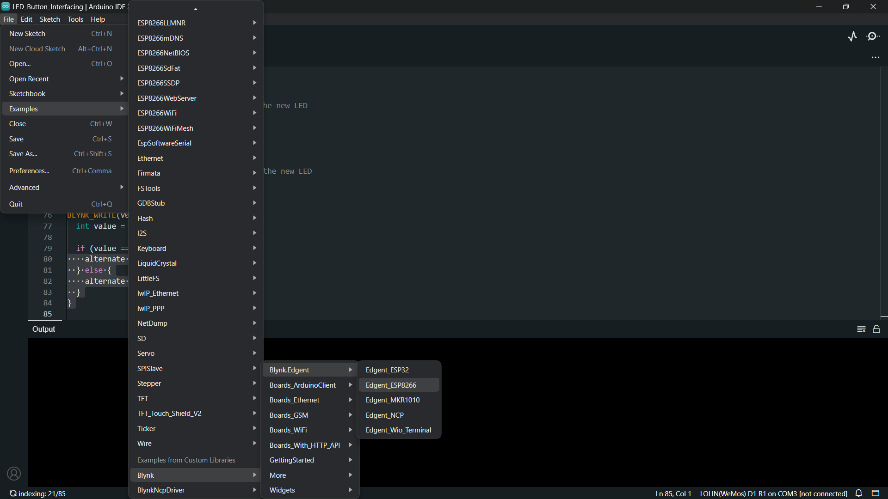
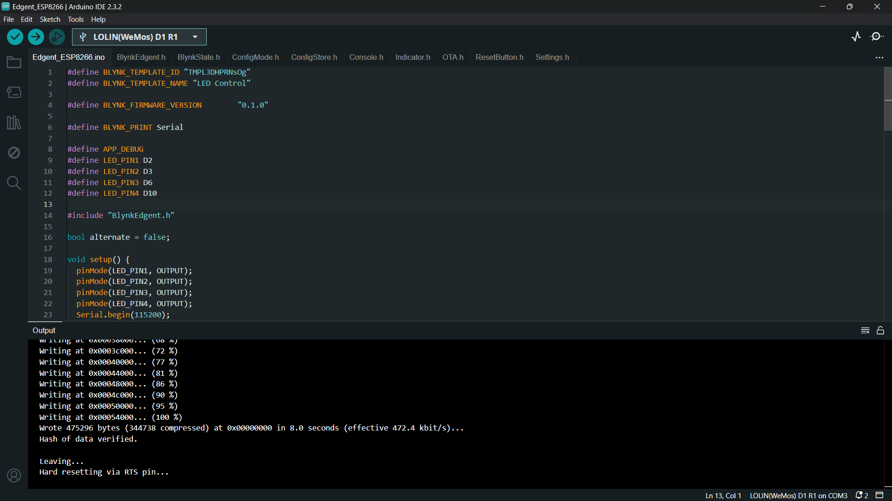

# Arduino Code Setup 💻

This guide provides step-by-step instructions for setting up and uploading the Arduino code for the ESP8266 LED Interfacing project, including integration with the Blynk app for Wi-Fi control.

## Step 1: Install Arduino Software

1. **Download Arduino IDE**

2. **Install Arduino IDE**

3. **Launch Arduino IDE**

4. **Open Arduino IDE Preferences**

## Step 2: Add ESP8266 Board to Arduino IDE

1. Open the Arduino IDE.

2. Go to `File` > `Preferences`.

3. In the `Additional Board Manager URLs` field, add the following URL:   `http://arduino.esp8266.com/stable/package_esp8266com_index.json`

4. Click `OK` to close the Preferences window.

5. Go to `Tools` > `Board` > `Boards Manager...`.

6. Search for `esp8266` and install the `esp8266` board package by ESP8266 Community.

## Step 3: Select ESP8266 Board and Port

1. Connect your ESP8266 board to your computer via USB.

2. Go to `Tools` > `Board` and select `LOLIN(WeMos) D1 R1` as the board.

3. Go to `Tools` > `Port` and select the port to which your ESP8266 board is connected.

## Step 4: Install Blynk Library

1. Go to `Sketch` > `Include Library` > `Manage Libraries...`.

2. Search for `Blynk` and install the `Blynk` library by Blynk Inc.

## Step 5: Open and Upload Code

1. Open the Arduino code file (`LED_Interfacing.ino`) in the Arduino IDE.

2. Configure the code to include the Blynk library and Wi-Fi credentials.

3. Verify and compile the code by clicking the checkmark icon (Verify) in the upper left corner of the Arduino IDE.

4. Once the code is compiled without errors, upload it to the ESP8266 board by clicking the right arrow icon (Upload) next to the Verify button.

5. Wait for the upload process to complete.

## Step 6: Configure Blynk App

1. Download and install the Blynk app from the [App Store](https://apps.apple.com/us/app/blynk-control-arduino-raspberry/id808760481) or [Google Play](https://play.google.com/store/apps/details?id=cc.blynk).

2. Create a new project in the Blynk app.

3. Select the ESP8266 board as the device type.

4. Generate an authentication token and note it down.

5. Add widgets to the project dashboard to control the LEDs and monitor connectivity.

## Step 7: Run the Project

1. Connect your ESP8266 board to power.

2. Open the Blynk app on your mobile device and navigate to the project dashboard.

3. Use the widgets to control the LEDs and monitor connectivity.

4. Test different scenarios and functionalities to ensure proper operation.

## Blynk Web Interface Setup

1. Go to the [Blynk website](https://blynk.io/) and sign up for an account.

2. Once logged in, create a new project and select the ESP8266 board.

3. Configure the project settings and choose the appropriate connection type (Wi-Fi).

4. Add widgets to the project dashboard to control the LEDs and monitor connectivity.

## Screenshots 📸

### Board Selection

### Upload Code

### Final Output

